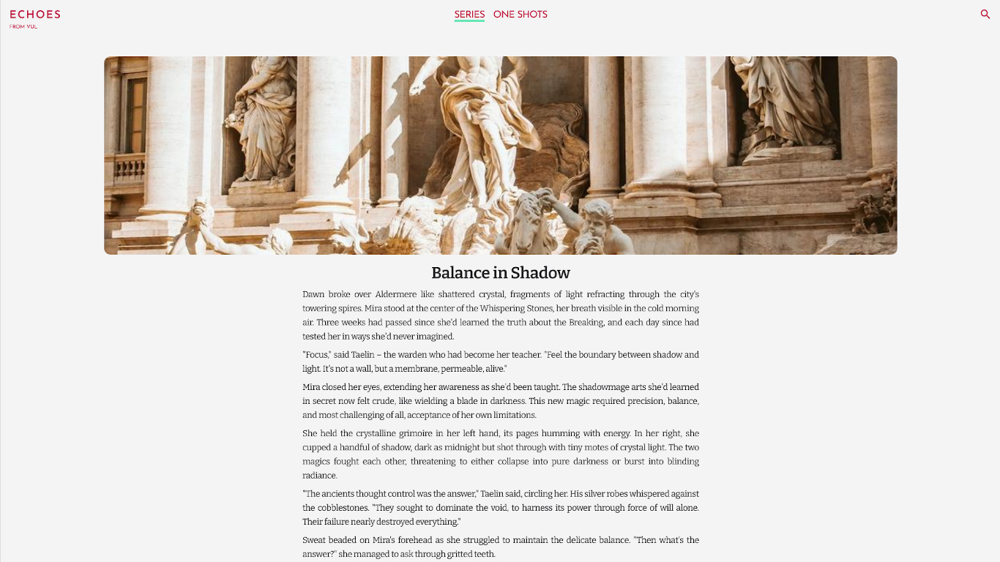

<div align="center" id="readme-top">
  <a href="https://github.com/gomisroca/echoes">
    
  </a>

<h3 align="center">ECHOES</h3>

  <p align="center">
    A writing site, offering the works of various authors and their series.
    <br />
    <a href="https://github.com/gomisroca/echoes"><strong>Explore the docs »</strong></a>
    <br />
    <br />
    <a href="https://echoes-writing.vercel.app">View Demo</a>
    ·
    <a href="https://github.com/gomisroca/echoes/issues/new?labels=bug&template=bug-report---.md">Report Bug</a>
    ·
    <a href="https://github.com/gomisroca/echoes/issues/new?labels=enhancement&template=feature-request---.md">Request Feature</a>
  </p>
</div>

<!-- TABLE OF CONTENTS -->
<details>
  <summary>Table of Contents</summary>
  <ol>
    <li>
      <a href="#about-the-project">About The Project</a>
      <ul>
        <li><a href="#built-with">Built With</a></li>
      </ul>
    </li>
    <li>
      <a href="#getting-started">Getting Started</a>
      <ul>
        <li><a href="#prerequisites">Prerequisites</a></li>
        <li><a href="#installation">Installation</a></li>
      </ul>
    </li>
    <li><a href="#usage">Usage</a></li>
    <li>
      <a href="#adjustments">Adjusting the Codebase</a>
      <ul>
        <li><a href="#replacing-cms">Replacing Sanity</a></li>
      </ul>
    </li>
    <li><a href="#roadmap">Roadmap</a></li>
    <li><a href="#license">License</a></li>
    <li><a href="#contact">Contact</a></li>
  </ol>
</details>

<!-- ABOUT THE PROJECT -->
<h2 id="about-the-project">📡 About The Project</h2>



The project is a web application that showcases writing pieces from different authors, organized in one-shots and series.

### Built With


<p align="right">[<a href="#readme-top">back to top</a>]</p>

<!-- GETTING STARTED -->
<h2 id="getting-started">📋 Getting Started</h2>

Follow these steps to get your own local copy of the project up and running.

<h3 id="prerequisites">Prerequisites</h3>

Make sure you have node.js and npm installed on your machine.

- npm
  ```sh
  npm install npm@latest -g
  ```
  Beyond this, if you plan on adjusting the codebase, you might need some knowledge of Astro, React or Sanity depending on the changes you plan on making.

<h3 id="installation">Installation</h3>

1. Clone the repo
   ```sh
   git clone https://github.com/gomisroca/echoes.git
   ```
2. Install NPM packages
   ```sh
   npm install
   ```
3. Change git remote url to avoid accidental pushes to base project
   ```sh
   git remote set-url origin github_username/repo_name
   git remote -v # confirm the changes
   ```

<p align="right">[<a href="#readme-top">back to top</a>]</p>

<!-- USAGE EXAMPLES -->
<h2 id="usage">💠 Usage</h2>

You can run the project in development mode from the main folder with **npm run dev**.

<p align="right">[<a href="#readme-top">back to top</a>]</p>

<!-- ADJUSTMENTS -->
<h2 id="adjustments">🔨 Adjusting the Codebase</h2>

  <h3 id="replacing-cms">📑 Replacing Sanity</h3>

By default, the project uses Sanity as its CMS to provide the content displayed. If you wish to replace it, you will have to remove the sanity related packages, remove Sanity from the Astro config file, and remove the Sanity config file. Furthermore, you will need to replace the logic inside the sanity folder with your own logic, and adjust certain components that make use of SanityImage or SanityDocument.

<p align="right">[<a href="#readme-top">back to top</a>]</p>

<!-- ROADMAP -->
<h2 id="roadmap">📍 Roadmap</h2>

- [ ] Improve related posts section utilizing tags.
- [ ] Improve search functionality.
  - [ ] Support series search.

See the [open issues](https://github.com/gomisroca/echoes/issues) for a full list of proposed features (and known issues).

<p align="right">[<a href="#readme-top">back to top</a>]</p>

<!-- LICENSE -->
<h2 id="license">🔒 License</h2>

Distributed under the MIT License. See `LICENSE.txt` for more information.

<!-- CONTACT -->
<h2 id="contact">📧 Contact</h2>

Adrià Gomis - [@gomisroca](https://github.com/gomisroca) - gomisroca@gmail.com

<p align="right">[<a href="#readme-top">back to top</a>]</p>
